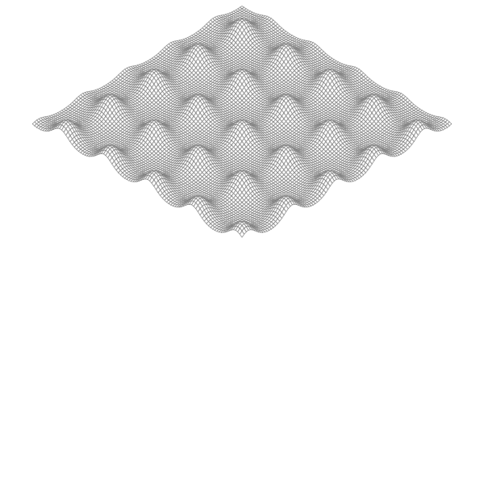

# Exercise 3.

---
# 練習問題 3.2
`math`パッケージの別の関数で可視化を試してみなさい。みなさんは、鶏卵の箱、モーグルのこぶ、乗馬用の蔵などを生成できますか。


# Result

````sh
$  go run surface.go > test.svg
$  qlmanage -t -s 600 -o ./ ./test.svg
````
### モーグルのこぶ

